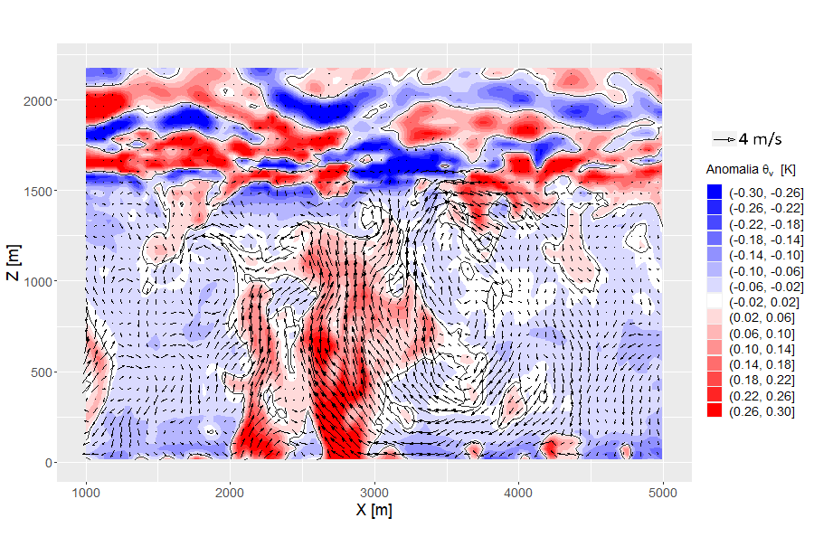
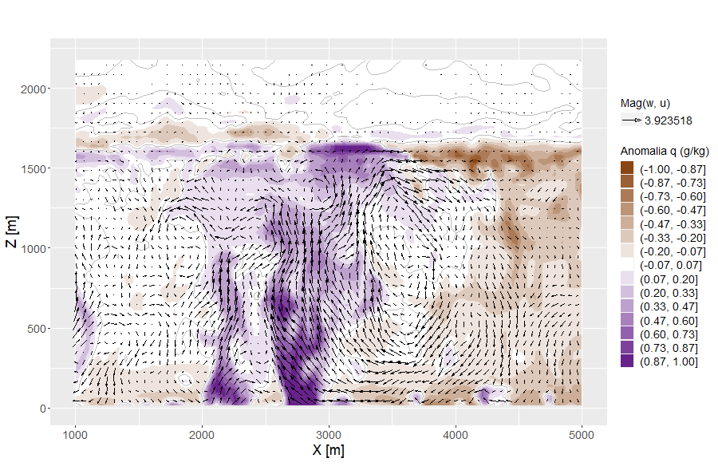

# PALM-simulation

Este repositorio contiene los archivos de entrada y algunos resultados de una simulación realizada con el modelo PALM.

## Archivos incluidos

- `inputs/e1_cbl_p3d`: Configuración de la corrida
- Carpeta `imagenes/`: Contiene visualizaciones de los resultados

## Resultados

Algunas de las imágenes generadas:
Corte vertical de Theta_v:

Corte vertical de q:

Corte horizontal de w:

Corte vertical de Theta_v (animación cada 10 segundos):

## Sobre el modelo PALM

PALM (Parallelized Large-Eddy Simulation Model) es un modelo LES que se utiliza para simular flujos atmosféricos urbanos y rurales. 

Más información en: [https://palm-model.org](https://palm-model.org)
